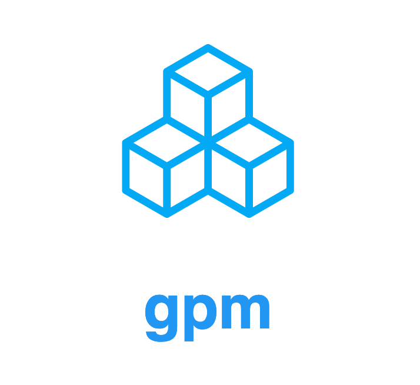

<div align="center">
    

<strong>Google Cloud Project Manager</strong>

<p><strong>gpm</strong> is an engineer productivity CLI for switching fast between multiple Google Cloud Platform (GCP) projects ⚡️</p>

</div>

<hr />

## ✨ Features

- Allows fast switching between GCP projects.
- Takes care of your [Application Default Credentials (ADC)](https://cloud.google.com/sdk/gcloud/reference/auth/application-default) so that you don't have to gather them after switching a project.
- Support for defining your GCP project directly in your repository.

## 🏃🏽‍♀️ Motivation

When you're deploying projects to the Google Cloud Platform, chances are high that you have `gcloud` configured locally. Although, `gcloud` allows the configuration of multiple projects and accounts, it doesn't support multiple Application Default Credentials (ADC) out of the box. ADCs are useful if you develop on your local machine, but communicate with GCP services directly in the cloud. For example, all official Google Cloud libraries for Node.js are using ADCs so that no further service account configuration is necessary.

`gpm` faces this problem by adding your local configured `gcloud` project to an own repository, including your configured ADCs. With this in place, it is possible to switch between projects quite easily _without_ executing `gcloud auth application-default login` over and over again.

## 📦 Installation

```
npm i -g @openformation/gpm
```

Alternatively, when you're using `npm` in your projects, you could install `gpm` as a `devDependency` and execute it in your _npm run scripts_ accordingly:

```
npm i -D @openformation/gpm
```

## 🔧 Usage

### Adding existing projects

Due to the fact that you will have a configured Google Cloud project in place, we add this to the `gpm` repository right now:

```
gpm register
```

Adds your currently configured project to the repository. Performing a `gpm info` will show you that this was successful.

### Adding new projects

When you are using `gpm` and want to add another `gcloud` project, you have to _deactivate_ the project you're currently using with `gpm`, perform the `gcloud` initialization and register the project in the `gpm` repository afterwards:

```
gpm deactivate

gcloud init

gpm register
```

### Activating a project

#### Via the CLI

When you want to switch between projects, you have to options: 1.) Selecting it through the `gpm` CLI or 2.) Using a local `.gpmrc` which – for example – lives in your source repository. Let's checkout both ways:

```
gpm activate
```

This command gives you a list of all `gcloud` projects that live in the `gpm` repository. You can select the one you want to use from this list.

#### Via a configuration file

As described above, the second apporach is via a configuration file (`.gpmrc`). This file includes the name of the project:

```bash
my-fancy-gcloud-project-v1
```

When executing a `gpm use` in the directory where this file lives, `gpm` will determine if the user has this project in her local repository and activates that accordingly.

### Automatic activation

We can go even deeper and create a small "bash" function which recognizes if you `cd` into a directory in which a `.gpmrc` lives. Whenever this function recognizes the file, it invokes `gpm use` so that the correct project gets activated.

To make this happen, add this function to your `~/.bashrc` or `~/.zshr` (depends on which shell you're using):

```bash
function cdgpm() {
  cd "$@";

  if [ -f $(pwd)/.gpmrc ]; then
    gpm use
  fi
}

alias cd='cdgpm'
cd $PWD
```

## 🎨 Contributing

You don't need to have any fancy prerequisites, just the current LTS release of Node.js

```bash
git clone git@github.com:openformation/gpm.git

cd gpm

# Install the correct Node.js version, using `fnm`
fnm use

# Install the dependencies
npm i
```

Now you are all set up for hacking on the code. Testing a CLI command, is possible via `ts-node`, for example ...

```
npx ts-node src/index.ts --version
```

... will print the version of `gpm`.

### Commitizen

[](http://commitizen.github.io/cz-cli/)

The project is using [commitizen](https://github.com/commitizen/cz-cli) for ensuring `semantic commit messages`. So whenever you perform a `git commit` an assistant will guide you through the steps of writing semantically correct commit messages.

## 👩🏽‍⚖️ Copyright

Copyright (C), 2021 Open Formation GmbH – Hamburg – Germany All Rights Reserved

Unauthorized copying of the files within this repository, via any medium is strictly prohibited proprietary and confidential.
